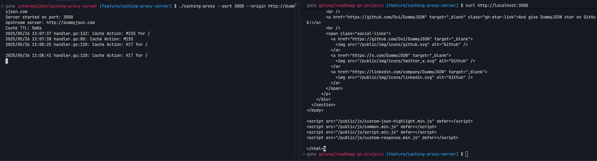

# Caching Proxy Server in `Go`

It is a `Go`-based caching proxy server that forwards requests to an origin server and caches the responses. When the same request is made again, the server returns the cached response instead of forwarding the request.

## Overview

This project involves the implementation of a caching proxy server that sits between clients and an origin server. The proxy server intercepts HTTP requests, forwards them to the origin server, and caches the responses. For subsequent identical requests, the server serves the cached response, which reduces the load on the origin server and improves response times.

## Features

- **HTTP Proxy**: Forwards HTTP requests to the configured origin server
- **Response Caching**: Caches responses from the origin server for faster subsequent access
- **Cache Control**: Configurable Time-To-Live (TTL) for cached responses
- **Cache Headers**: Adds X-Cache headers to indicate cache hits and misses
- **Cache Clearing**: Endpoint to clear the entire cache
- **Concurrent Access**: Thread-safe cache implementation using mutex locks

## Architecture

The project is organized into several packages:

- **cmd/caching-proxy**: Contains the main entry point for the application
- **internal/config**: Handles command-line flag parsing and configuration
- **internal/cache**: Implements the in-memory cache with TTL support
- **internal/handler**: Contains HTTP handlers for proxy and cache management

## Implementation Details

### Cache Implementation

The cache is an in-memory map with the following features:

- Uses request URL as the cache key
- Stores response headers, body, status code, and creation timestamp
- Thread-safe operations using read-write mutex locks
- Automatic expiration based on configurable TTL

### Request Handling

The proxy handles requests as follows:

- For non-cacheable requests (methods other than `GET` and `HEAD`), it forwards them directly to the origin server
- For cacheable requests, it checks if a valid (non-expired) cached response exists
- If a cache hit occurs, it serves the cached response with an `X-Cache: HIT` header
- If a cache miss occurs, it fetches from the origin server, caches the response if appropriate, and serves it with an `X-Cache: MISS` header

### Usage

#### Building the Application
To build the application, run:
```bash
go build -o caching-proxy cmd/caching-proxy/main.go
```

#### Running the Application
```bash
# Start with default settings (port 8800, origin https://dummyjson.com, TTL 300s)
./caching-proxy

# Start with custom settings
./caching-proxy --port 3000 --origin https://api.example.com --ttl 600
```

##### Command Line Flags

- `--port` : The port on which the caching proxy server will listen (default: 8800)
- `--origin` : The URL of the origin server to which requests will be forwarded (default: https://dummyjson.com )
- `--ttl` : Cache duration in seconds (default: 300)
- `--clear-cache` : Clear the entire cache

#### Limitations

- In-memory cache (data is lost when the server restarts)
- No cache size limits (could potentially consume a lot of memory)
- No cache invalidation other than TTL and manual clearing
- Limited HTTP method support for caching (only GET and HEAD)

#### Screenshots

Here is screenshot of the Caching Proxy Server in action:



## Project Link

- [ Caching Proxy](https://roadmap.sh/projects/caching-server)

## Acknowledgments

- Part of the Go programming language learning roadmap projects
- Created by [jaygaha](https://github.com/jaygaha)