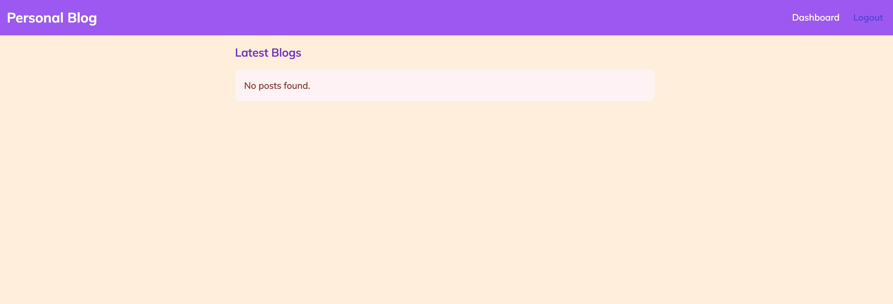
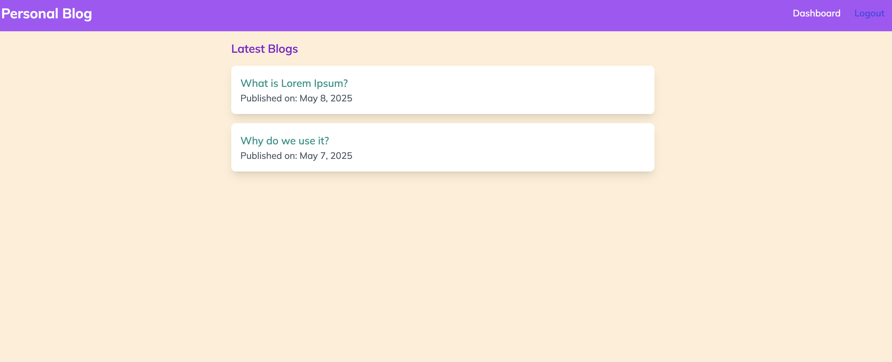
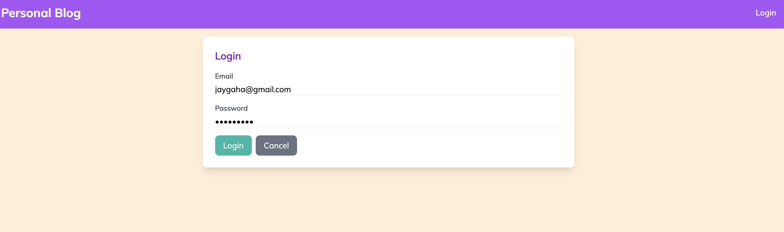
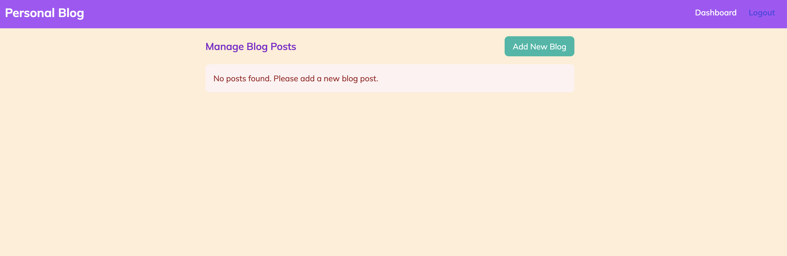
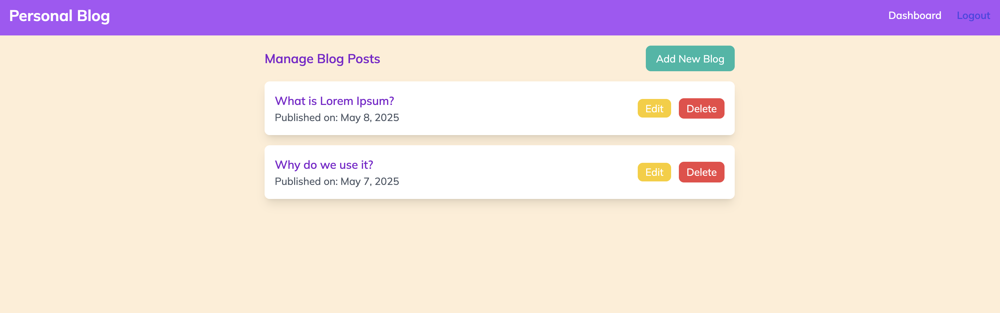
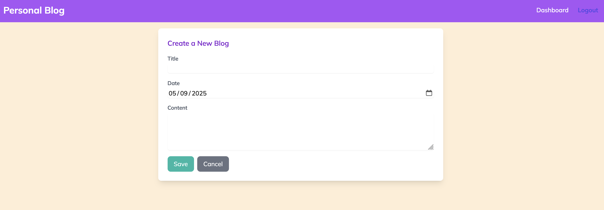
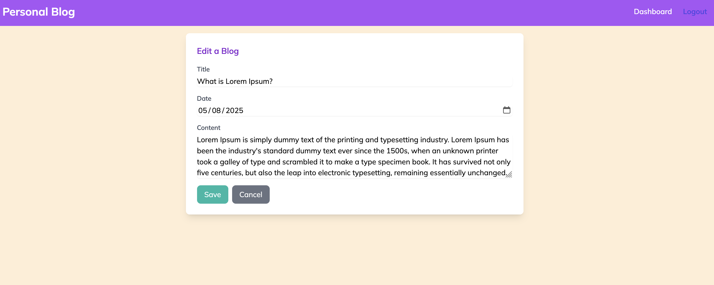
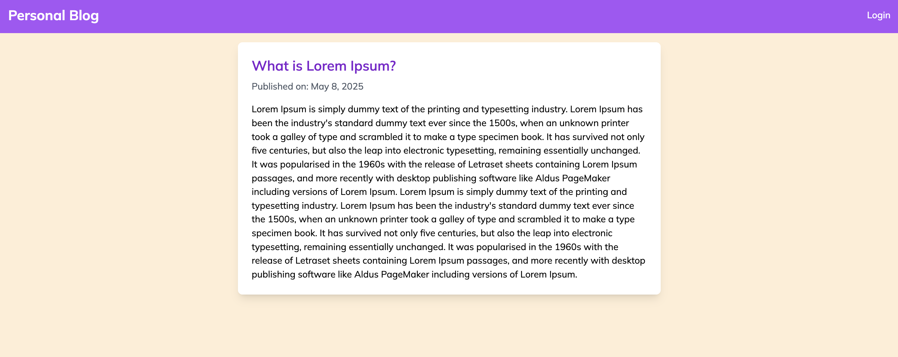

# Personal Blog App using `Go`

This project is a simple personal blog application built with Go. It provides a web interface for creating, reading, updating, and deleting blog posts with user authentication.

## Features

- User authentication (login/logout functionality)
- Admin dashboard for blog management
- Create, read, update, and delete blog posts
- Responsive design using Tailwind CSS
- JSON file-based storage for blog posts
- Pagination for blog listings

## Dependencies

- Go (Golang) 1.24.0
- HTML templates with Tailwind CSS (via CDN)

## Project Structure

- **main.go**: Entry point of the application
- **routes/web.go**: Web route definitions and middleware configuration
- **handlers/**: HTTP request handlers
  - **admin_handler.go**: Admin dashboard handlers
  - **auth_handler.go**: Authentication handlers
  - **blog_handler.go**: Blog CRUD operation handlers
  - **welcome_handler.go**: Home page handler
- **middleware/authenticate.go**: Authentication middleware
- **models/post.go**: Data structures for blog posts
- **providers/**:
  - **session.go**: Session management
  - **storage.go**: File-based storage operations
- **templates/**: HTML templates
- **static/**: Static assets (images, etc.)

## Installation

To install and run the personal blog app, ensure you have Go installed on your system. Then, clone the repository and build the application:

```bash
git clone https://github.com/jaygaha/roadmap-go-projects.git
cd roadmap-go-projects/personal-blog-app
go mod tidy
go build
```

## Usage

After building the application, you can run it with:

```bash
./personal-blog-app
```

The server will start on port 8800. You can access the application by navigating to `http://localhost:8800` in your web browser.

### Available Routes

- `/`: Home page showing all blog posts
- `/login`: Login page for authentication
- `/logout`: Logout endpoint (protected)
- `/admin`: Admin dashboard (protected)
- `/article/{id}`: View a specific blog post
- `/blogs/new`: Create a new blog post (protected)
- `/blogs/submit`: Submit a new blog post (protected)
- `/blogs/edit/{id}`: Edit an existing blog post (protected)
- `/blogs/update/{id}`: Update an existing blog post (protected)
- `/blogs/delete/{id}`: Delete a blog post (protected)

## Data Storage

The application uses a simple JSON file (`posts.json`) to store blog posts. Each post contains:

- ID: Unique identifier
- Title: Blog post title
- Description: Blog post content
- CreatedAt: Creation timestamp
- UpdatedAt: Last update timestamp (nullable)

## Authentication

The application uses a simple session-based authentication system. Protected routes require authentication through the middleware.

## Screenshots

Here are some screenshots of the Personal Blog App in action:

| Home Page (0 posts) | Home Page |
|:-------------------------:|:-------------------------:|
|  |  |
| **Login** | **Admin Dashboard (0 posts)** |
|  |  |
| **Admin Dashboard** | **Create New Blog Post** |
|  |  |
| **Edit Blog Post** | **View Blog Post** |
|  |  |


## Acknowledgments

- [roadmap.sh](https://roadmap.sh/projects/personal-blog) for the project inspiration
- Created by [jaygaha](https://github.com/jaygaha)