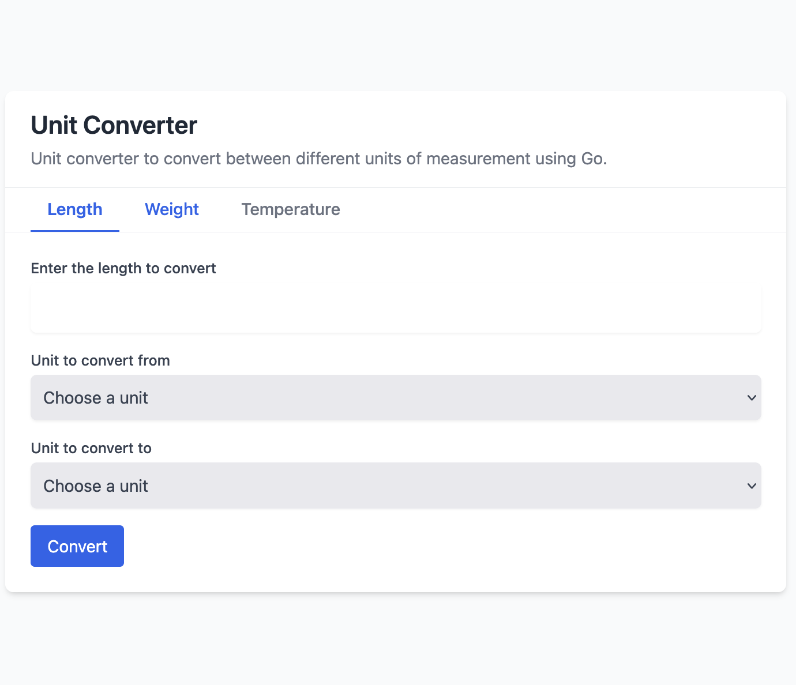

# Unit Converter App in Go

A web application built with Go that allows users to convert between different units of measurement. This project provides a simple and intuitive interface for converting length, weight, and temperature units.

## Features

- **Length Conversion**: Convert between millimeters (mm), centimeters (cm), meters (m), kilometers (km), inches (in), feet (ft), yards (yd), and miles (mi).
- **Weight Conversion**: Convert between milligrams (mg), grams (g), kilograms (kg), pounds (lb), and ounces (oz).
- **Temperature Conversion**: Convert between Celsius (°C), Fahrenheit (°F), and Kelvin (K).
- **Responsive UI**: Clean and intuitive user interface built with Tailwind CSS.
- **Real-time Conversion**: Instant conversion results without page reload using JavaScript.

## App Preview



The image above shows the user interface of the Unit Converter App, featuring the clean design with Tailwind CSS and the intuitive conversion form.

## Project Structure

```
unit-converter-app/
├── converter/           # Conversion logic for different unit types
│   ├── length.go        # Length conversion functions
│   ├── temperature.go   # Temperature conversion functions
│   └── weight.go        # Weight conversion functions
├── handlers/            # HTTP request handlers
│   ├── length_handler.go      # Handler for length conversion
│   ├── temperature_handler.go # Handler for temperature conversion
│   ├── weight_handler.go      # Handler for weight conversion
│   └── welcome_handler.go     # Handler for the welcome page
├── static/              # Static assets
│   ├── css/             # CSS files
│   ├── images/          # Image files
│   └── js/              # JavaScript files
├── templates/           # HTML templates
│   ├── forms/           # Form templates for each conversion type
│   └── layout.tmpl      # Main layout template
├── go.mod               # Go module file
└── main.go              # Application entry point
```

## Installation

### Prerequisites

- Go 1.24 or higher

### Steps

1. Clone the repository:
   ```bash
   git clone https://github.com/jaygaha/roadmap-go-projects.git
   cd roadmap-go-projects/unit-converter-app
   ```

2. Install dependencies:
   ```bash
   go mod tidy
   ```

3. Run the application:
   ```bash
   go run main.go
   ```

4. Open your browser and navigate to:
   ```
   http://localhost:8800
   ```

## Usage

1. Select the conversion type tab (Length, Weight, or Temperature).
2. Enter the value you want to convert.
3. Select the unit to convert from.
4. Select the unit to convert to.
5. Click the "Convert" button to see the result.

## API Endpoints

The application provides the following API endpoints for conversion:

- **POST /api/length**: Convert length units
- **POST /api/weight**: Convert weight units
- **POST /api/temperature**: Convert temperature units

## Acknowledgements

- This project was created as part of the [roadmap.sh](https://roadmap.sh/projects/unit-converter) backend project challenges.
- UI built with [Tailwind CSS](https://tailwindcss.com/).